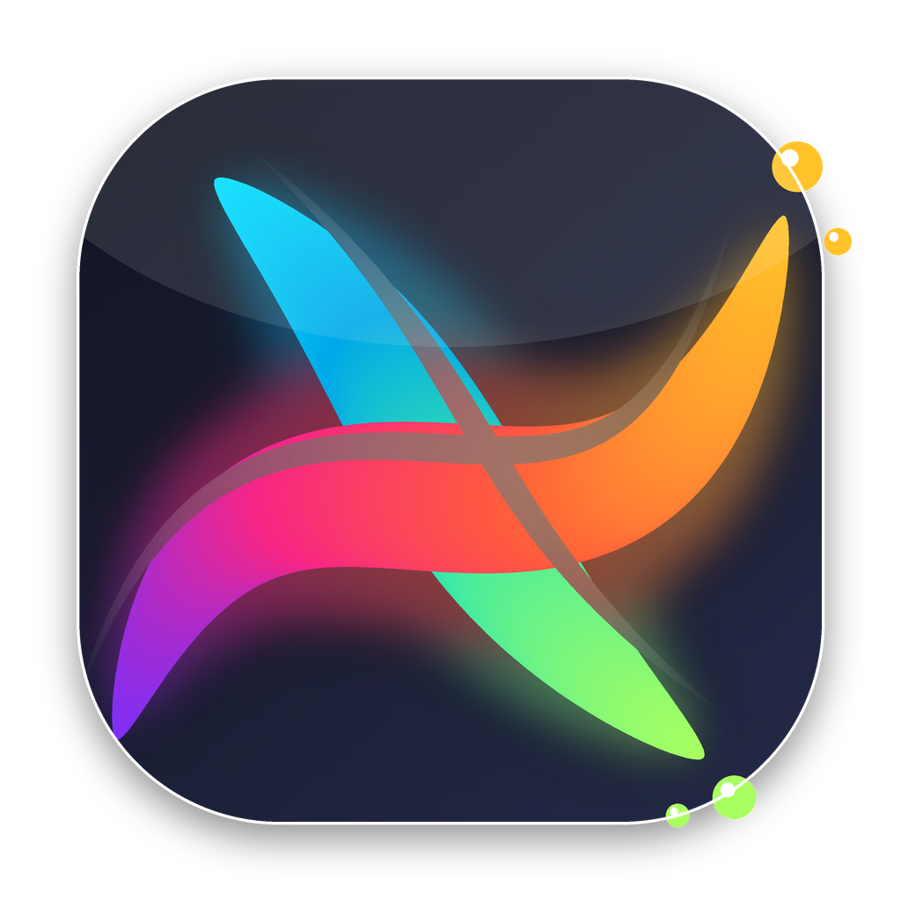
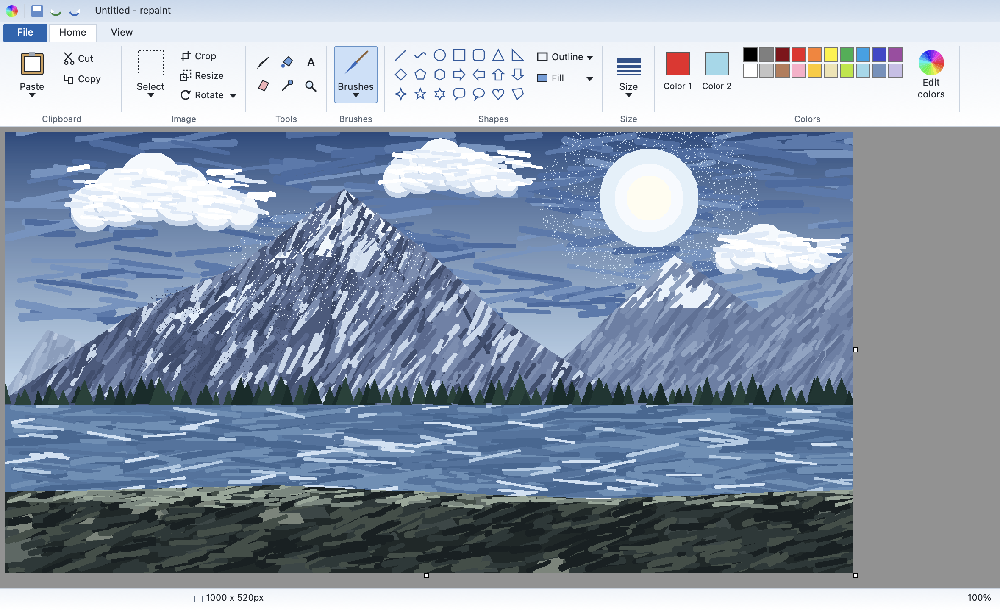
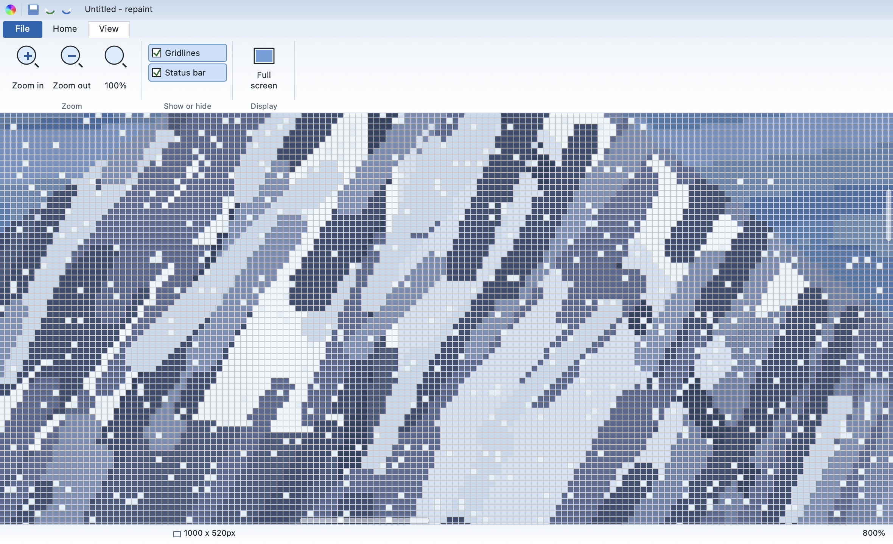

# repaint

A paint program for macOS, laid out like the old Windows Paint ribbon.
Written in Swift with AppKit and Core Graphics. No dependencies, no Xcode
project, no package manifest. One shell script builds it.

<br clear="left">



The picture on the canvas is generated by `Shots/main.swift`, which paints it
with the same routines the tools use: filled polygons, round brush dabs,
scattered airbrush pixels, and hard non-antialiased edges throughout.

## Build

```bash
git clone https://github.com/molanocortes/repaint.git
cd repaint
./build.sh --install
```

That compiles the sources, runs the tests, draws the icon, and copies
`repaint.app` into `/Applications`. Needs the Xcode Command Line Tools; it does
not need Xcode itself.

`./build.sh` on its own just builds into the project folder. Set `RUN_TESTS=0`
to skip the test step.

The app is signed ad hoc, not with a paid Developer ID, so the first
double-click will be refused. Right-click it in Finder, pick Open, and confirm
once. After that it opens normally.

## What's in it

Sixteen tools: pencil, brush, airbrush, eraser, fill, colour picker,
magnifier, text, the two selection tools, and the shape tools.

Twenty-one shapes, all drawn by dragging out a box: line, curve, oval,
rectangle, rounded rectangle, triangle, right triangle, diamond, pentagon,
hexagon, four arrows, three stars, two callouts, heart, and polygon.

Two colours, the way Paint always did it. Left-click draws with Colour 1,
right-click with Colour 2. Shape outlines use Colour 1 and fills use Colour 2.
Clicking a palette swatch sets Colour 1, right-clicking sets Colour 2.

Selections you can drag, resize by the handles, option-drag to leave a copy,
nudge with the arrow keys, and cut, copy or paste. Transparent mode drops
Colour 2 out of the pasted pixels.

Crop, resize, rotate, flip, stretch and skew, invert colours, and a canvas you
can resize by dragging the grips on its edges. Fifty levels of undo. Opens and
saves PNG, JPEG, BMP, GIF and TIFF. Printing works.

Nothing is antialiased. That is on purpose. Zoom uses nearest neighbour, so at
400% you get hard square pixels and an optional grid.



Every ribbon dropdown also lives in the macOS menu bar, under Tools, Shapes and
Image, so you can drive the whole thing from the keyboard.

## Shortcuts

| | |
|---|---|
| ⌘N ⌘O ⌘S ⇧⌘S | New, Open, Save, Save As |
| ⌘Z ⇧⌘Z | Undo, redo |
| ⌘X ⌘C ⌘V ⌘A | Cut, copy, paste, select all |
| ⌘E | Canvas size |
| ⌘R ⌘W | Flip and rotate, stretch and skew |
| ⌘I | Invert colours |
| ⌘G | Grid |
| ⌘1 ⌘2 ⌘4 ⌘6 ⌘8 | Zoom |
| Esc | Deselect, or cancel a text box |
| Arrows | Nudge the selection, shift for 10px |

A few tools work like they did in Paint and are worth knowing about. The curve
tool wants three drags: one for the line, then two to bend it. The polygon tool
takes a click per corner and closes on a double-click or a right-click. The
magnifier zooms in on left-click and out on right-click. Right-dragging the
eraser only erases Colour 1 and leaves everything else alone.

## Tests

```bash
./build/EngineTest /tmp
./build/UITest
```

`build.sh` runs both. The first covers the raster side: flood fill, all
twenty-one shape paths, crop, canvas resize, flip and rotate, stretch and skew,
the undo stack, and every file format written and read back. It checks
orientation with corner markers, which is how I caught a blit that was drawing
every opened and pasted image upside down.

The second builds a real window off screen and calls the same handlers the
ribbon buttons call, so tool selection, shapes, brushes, sizes, outline and
fill, crop, rotate, zoom, tabs, colours, undo, redo and the clipboard all get
exercised without a display. It saves and restores the pasteboard around the
copy and paste checks.

## Status

Early. The engine, the ribbon and the menu bar are covered by tests. The modal
dialogs (Save, Open, Stretch and Skew, Properties, the colour picker) and the
text tool are wired up but have not had a proper manual pass. Issues welcome.

## Layout

| File | |
|---|---|
| `Sources/Bitmap.swift` | Pixel buffer, flood fill, transforms, crop, resize |
| `Sources/PaintState.swift` | Tools, shapes, palette, settings, undo |
| `Sources/CanvasView.swift` | Drawing surface, tool handling, selections, text |
| `Sources/Chrome.swift` | Ribbon styling and every icon |
| `Sources/Ribbon.swift` | Ribbon layout and hit testing, status bar |
| `Sources/MainWindow.swift` | Window, commands, file handling, dialogs |
| `Sources/AppDelegate.swift` | Menu bar |
| `make_icon.py` | Draws the app icon |
| `Shots/main.swift` | Renders the screenshots in this README |

Every icon in the ribbon is drawn in code. There are no image assets in the
app bundle apart from the icns file, and that is generated too.

## Licence

MIT. Not affiliated with Microsoft. Written from scratch, no Microsoft code or
artwork in it.
